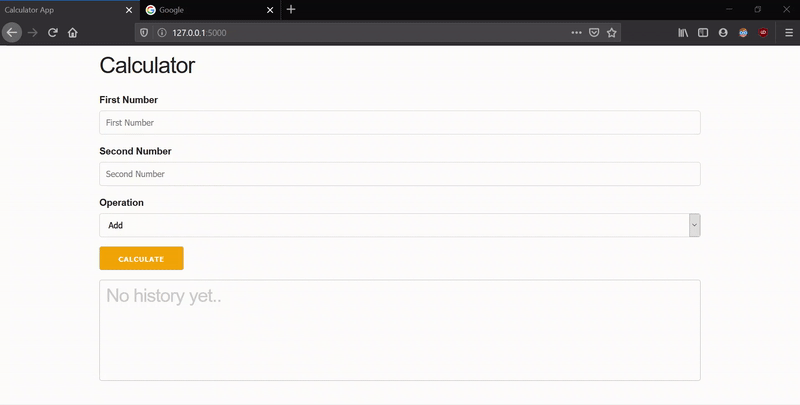

# Sezzle Calculator API
A calculator API which stores calculations as they happen and shares those calculations with all the users of that API.

## Prerequisites and Installation
First install pipenv to create a virtual environment with all the project dependencies.

```bash
 pip install pipenv
```
Now, clone the project files on your local system.

Open the CALC_API folder and run the below command:
```bash
pipenv install
pipenv shell
```
To compile and run the application run the below command:
```bash
python app.py
```
To start the application, open browser and enter the below address:
```textile
http://127.0.0.1:5000
```

## Demo


